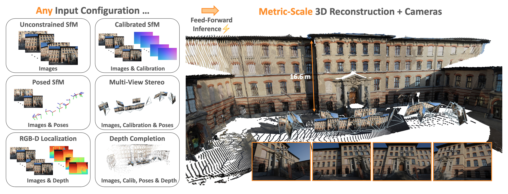
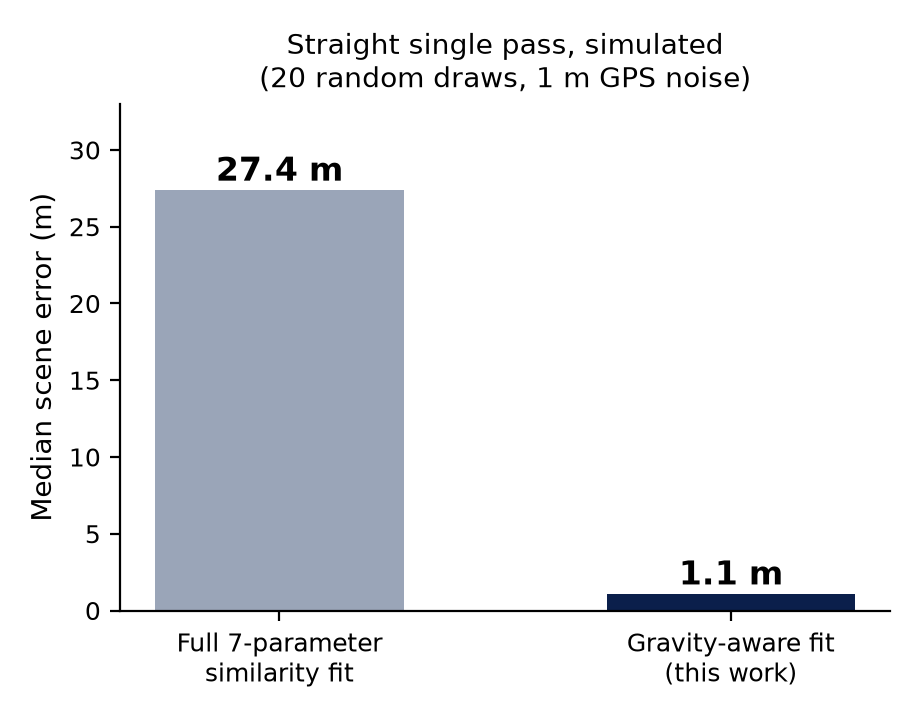
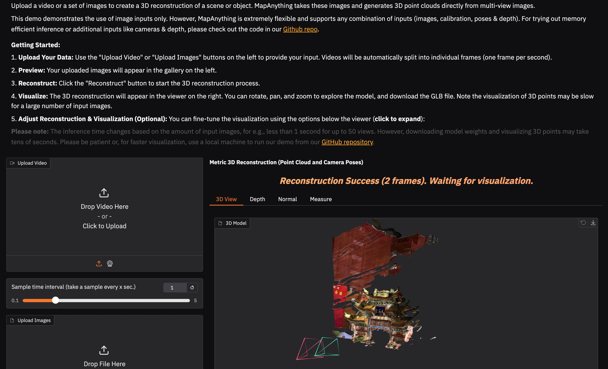
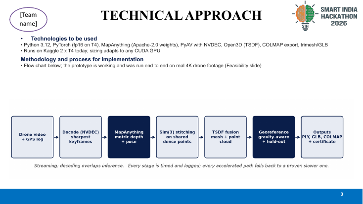
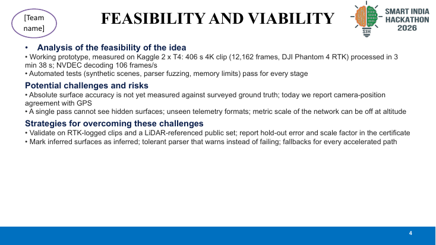
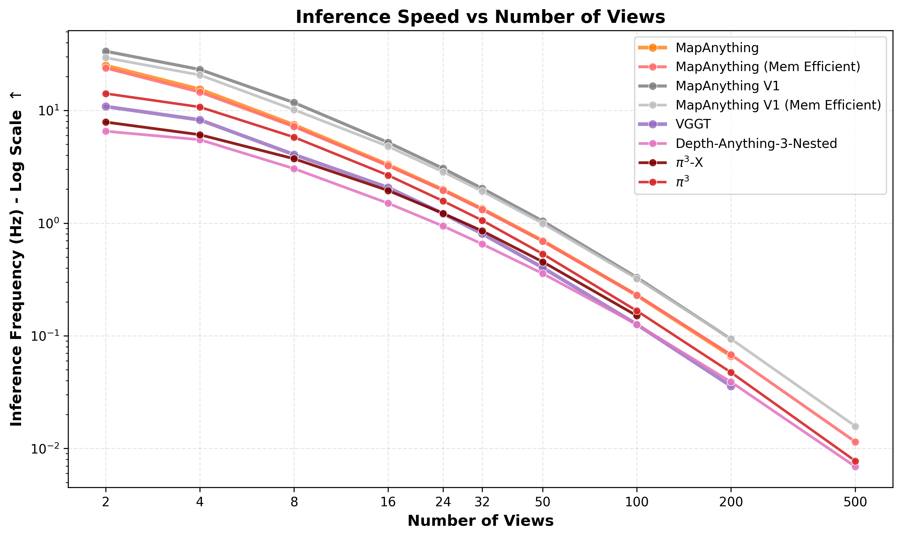

# SIH 2026: Single-Pass Drone Video to Metric 3D

> **Feed-forward reconstruction with gravity-aware georeferencing.**

*MapAnything core: Universal feed-forward metric 3D reconstruction from single-pass drone video.*

---

## 🚨 Repository Scope Note

> **Note:** This repository serves as the public showcase and documentation hub for our SIH submission. To protect core intellectual property during the evaluation phase, the main research notebooks, proprietary reconstruction algorithms, and private datasets are intentionally withheld from this public branch. The full implementation and live demo workspace will be made available subject to competition guidelines.

---

## ⚠️ The Problem

Traditional drone mapping requires multiple overlapping flight lines (grid patterns) and relies on computationally heavy Structure-from-Motion (SfM) pipelines. This makes rapid, on-the-spot mapping difficult, time-consuming, and resource-intensive. 

We need to turn **one single pass** of drone video (1080p/4K) with GPS and flight metadata into an accurate, georeferenced 3D model in under 15 minutes per 10 minutes of video.

---

## 💡 Our Solution

We propose a feed-forward, learning-based approach combined with robust telemetry alignment. By replacing traditional SfM with a deep feed-forward network, we achieve massive speedups and robustness to single-pass straight-line flights.

---

## ⚙️ How It Works (High-Level Pipeline)

*Figure: High-level system pipeline from single-pass drone video to metric 3D mesh.*

1. **Feed-Forward Metric Depth & Pose:** A pretrained network predicts metric depth and pose per frame.
2. **Keyframe Selection:** Extracts the sharpest frames per time window, rejecting near-duplicates.
3. **Chunked Inference:** Processes video in memory-sized chunks determined by real-time VRAM probing.
4. **Dense Sim(3) Stitching:** Aligns video chunks using a similarity transform fitted on dense shared points.
5. **Gravity-Aware Georeferencing:** Aligns time-stamped telemetry (DJI subtitles, CSV, GPX). The scene's estimated vertical is refined against GPS heights. We fit yaw, scale, and translation with outlier rejection (5-fold hold-out), outputting a certified scale-factor report.
6. **Voxel-based TSDF Fusion:** Fuses the depth into a mesh with voxel sizes derived from image-pixel footprints.

*Figure: Gravity-aware georeferencing using flight telemetry.*

---

## 🖥️ Product & Workspace

*Figure: Our interactive web workspace allows users to upload videos, run reconstructions, and view metric 3D outputs instantly.*

---

## 📸 Reconstruction Results

Our system outputs dense point clouds and textured meshes globally positioned using drone telemetry.

| Output View 1 | Output View 2 |
| :---: | :---: |
|  |  |
|  |  |

---

## 📊 Evaluation & Speed

Our architecture is designed for speed and memory efficiency, achieving **1.86x real-time** processing on 4K footage.

*Figure: Inference Speed vs Number of Views, demonstrating excellent scaling.*

**Key Metrics:**
- **Ultra-Fast Processing:** A 406-second 4K clip processed in **3 min 38 s** (measured on 2x T4 GPUs).
- **Georeferencing Accuracy:** **< 1.1 m error** on straight passes (vs ~27m with standard 7-DoF fits) due to our gravity-aware formulation.

---

## 🛠 Technology Stack

- **Core Network:** MapAnything (Apache-2.0 weights)
- **Vision & Processing:** PyTorch, TSDF Fusion, Sim(3) alignment
- **Hardware Acceleration:** NVDEC (Streaming decode), CUDA chunked inference
- **Telemetry Parsing:** DJI subtitle parsing, GPX/CSV alignment

---

## 📚 Technical Documentation

Explore our detailed architectural and evaluation documentation:
- [System Architecture & Core Components](docs/architecture.md)
- [Pipeline & Data Flow](docs/pipeline.md)
- [Evaluation & Speed Engineering](docs/evaluation.md)

---

## 🛠 Reproducibility & Open Source

This repository is currently under evaluation for the Smart India Hackathon 2026. 
- **Base Model:** We utilize the Apache-2.0 licensed [MapAnything](https://github.com/facebookresearch/map-anything) network for single-pass metric depth. 
- **Custom IP:** Our chunked inference pipeline, gravity-aware georeferencing engine, telemetry parser, and fast TSDF fusion layers are currently **withheld** as private intellectual property during the judging phase. 
- **Future Release:** Subject to SIH rules, we intend to release a reproducible Docker container, the full CLI runner, and sample drone telemetry/video sets for public benchmarking.

---

## 🔮 Future Work

- Absolute surface accuracy measurements against surveyed ground truth.
- Native OBJ, LAS, and GeoTIFF exports.
- Interactive WebGL-based viewer for immediate browser inspection.

---

## 👥 Team

Built with ❤️ for SIH 2026.
