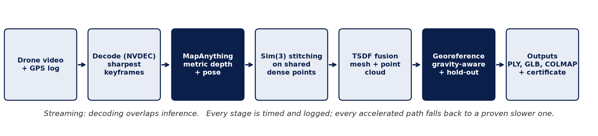
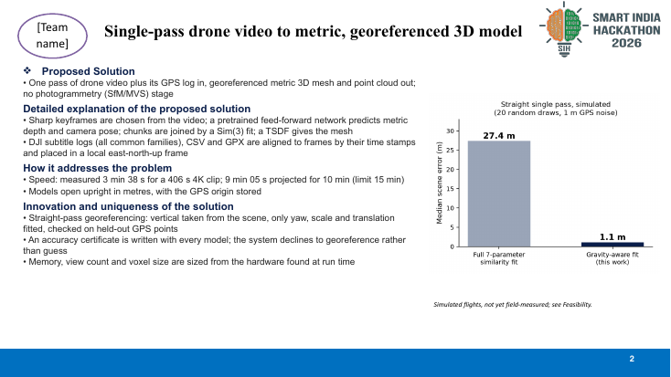
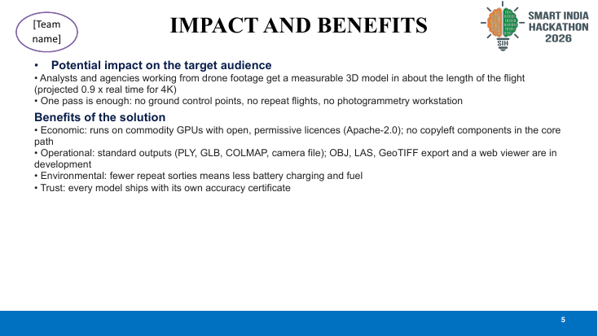
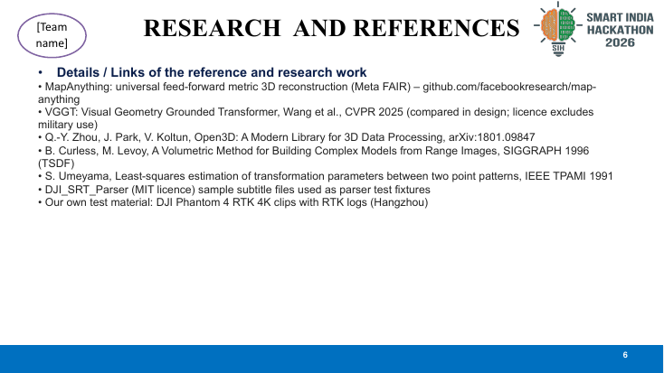

# SIH 2026: Single-Pass Drone Video to Metric 3D

> **Feed-forward reconstruction with gravity-aware georeferencing.**

## 📌 Project Overview

This repository contains the public-facing documentation and presentation assets for our SIH 2026 submission (SIH26158).

We reconstruct a georeferenced, metric 3D model from **one pass of drone video** without relying on traditional structure-from-motion (SfM) or multi-view stereo (MVS) pipelines. Using a pretrained feed-forward network, we predict per-frame depth and camera pose in metric units. The pipeline accurately fuses the outputs into a textured mesh and point cloud, globally positioned using drone telemetry.

---

## 🚨 Repository Scope Note

> **Note:** This repository serves as the public showcase and documentation hub for our SIH submission. To protect core intellectual property during the evaluation phase, the main research notebooks, proprietary reconstruction algorithms, and private datasets are intentionally withheld from this public branch. The full implementation and live demo workspace will be made available subject to competition guidelines.

---

## ⚠️ Problem Statement

Traditional drone mapping requires multiple overlapping flight lines (grid patterns) and relies on computationally heavy Structure-from-Motion (SfM) pipelines. This makes rapid, on-the-spot mapping difficult, time-consuming, and resource-intensive. 

We need to turn **one single pass** of drone video (1080p/4K) with GPS and flight metadata into an accurate, georeferenced 3D model in under 15 minutes per 10 minutes of video.

---

## 💡 Our Solution

We propose a feed-forward, learning-based approach combined with robust telemetry alignment:

1. **Feed-Forward Metric Depth & Pose:** A pretrained network predicts metric depth and pose per frame.
2. **Keyframe Selection:** Extracts the sharpest frames per time window, rejecting near-duplicates.
3. **Chunked Inference:** Processes video in memory-sized chunks determined by real-time VRAM probing.
4. **Dense Sim(3) Stitching:** Aligns video chunks using a similarity transform fitted on dense shared points.
5. **Gravity-Aware Georeferencing:** Aligns time-stamped telemetry (DJI subtitles, CSV, GPX). The scene's estimated vertical is refined against GPS heights. We fit yaw, scale, and translation with outlier rejection (5-fold hold-out), outputting a certified scale-factor report.
6. **Voxel-based TSDF Fusion:** Fuses the depth into a mesh with voxel sizes derived from image-pixel footprints.

---

## 🏗 High-Level Pipeline & Architecture

*Figure: High-level system pipeline from single-pass drone video to metric 3D mesh.*

*Figure: Gravity-aware georeferencing using flight telemetry.*

---

## ⚡ Key Capabilities

- **Ultra-Fast Processing:** A 406-second 4K clip (12,162 frames, DJI Phantom 4 RTK) processed in **3 min 38 s** (measured on 2x T4 GPUs).
- **Single-Pass Robustness:** Designed specifically for straight flight lines, utilizing a specialized 7-parameter fit (vertical scene direction + yaw/scale/translation).
- **Hardware-Adaptive Inference:** Memory use, view count, and voxel size are dynamically derived from hardware found at run time. Stream decoding runs on NVDEC at 106 frames/s.
- **Resilient Georeferencing:** Malformed telemetry never stops the run. All optimizations seamlessly fall back to proven paths if needed.
- **Rich Outputs:** Generates PLY mesh, point clouds, GLB, COLMAP models, and a camera file with georeference and display transforms.

---

## 🛠 Technology Stack

- **Core Network:** MapAnything (Apache-2.0 weights)
- **Vision & Processing:** PyTorch, TSDF Fusion, Sim(3) alignment
- **Hardware Acceleration:** NVDEC (Streaming decode), CUDA chunked inference
- **Telemetry Parsing:** DJI subtitle parsing, GPX/CSV alignment

---

## 📸 Visual Showcase

### Reconstruction Previews

| Point Cloud View 1 | Point Cloud View 2 |
| :---: | :---: |
|  |  |
|  |  |
|  |  |

---

## 🔮 Future Work

- Absolute surface accuracy measurements against surveyed ground truth (currently, camera-position agreement with GPS is certified).
- Native OBJ, LAS, and GeoTIFF exports.
- Interactive WebGL-based viewer for immediate browser inspection.

---

## 👥 Team

Built with ❤️ for SIH 2026.
