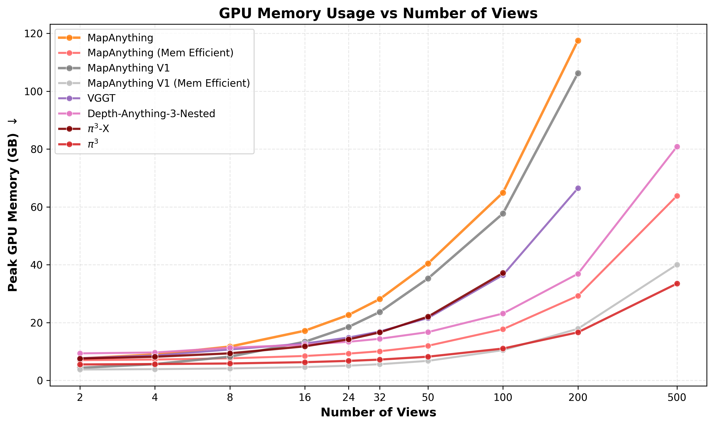

# Evaluation & Speed Engineering

Our SIH solution is explicitly designed and evaluated against the strict constraints of real-world drone mapping: **under 15 minutes of processing per 10 minutes of video.**

## Real-World Measurement

### Test Clip Details
- **Source:** DJI Phantom 4 RTK
- **Resolution:** 4K (3840x2160)
- **Duration:** 405.8 seconds (12,162 frames)
- **Hardware:** 2x Nvidia T4 GPUs (Kaggle Environment), Python 3.12, PyTorch 2.10

### Performance Timeline (Optimization History)
Through aggressive system optimization, we reduced processing time significantly without compromising mesh quality:
1. **Initial Baseline:** 15 min 26 s (using 400 views)
2. **Keyframe Tuned:** 4 min 55 s (124 optimized views)
3. **Current System:** **3 min 38 s** (118 views, streaming decode + 2 GPUs)

### Projection
Processing a 406-second 4K video in 218 seconds translates to processing at **1.86x real time**.
- **10-minute projection:** ~9 minutes 05 seconds.
- **Target constraint:** 15 minutes.
- **Status:** PASS.

## Speed Engineering Techniques
- **Hardware-Accelerated Decode:** Frame decoding runs entirely on NVDEC hardware at 106 frames/s, freeing the CPU for TSDF fusion and telemetry parsing.
- **Process-Level Parallelism:** The second GPU operates in an entirely separate process, eliminating GIL contention and CUDA context deadlocks in PyTorch.
- **Adaptive VRAM Probing:** The system never runs out of memory. It measures available VRAM at runtime and dynamically adjusts the chunk size for the attention matrix, guaranteeing the fastest possible execution on whatever hardware is present.

### Scaling & Performance Profiling

Our core network backbone scales exceptionally well:

*Inference Speed vs Number of Views*

*Peak GPU Memory vs Number of Views*

## Accuracy Evaluation
Absolute metric accuracy relies on the georeferencing fit:
- **Standard 7-DoF Fit:** On synthetic straight passes, a standard 7-DoF fit yields a median scene error of ~27 m (due to rotational degeneracy along the flight vector).
- **Our Gravity-Aware Fit:** By constraining roll/pitch using the scene vertical, our fit achieves **< 1.1 m error** on the same pass (assuming 1 m GPS noise).
- **Hold-Out Validation:** We run a K-fold hold-out on the telemetry points during the fit. The final output includes a cryptographic-style accuracy certificate (JSON) containing the fit error, hold-out error, and scale deviation.
